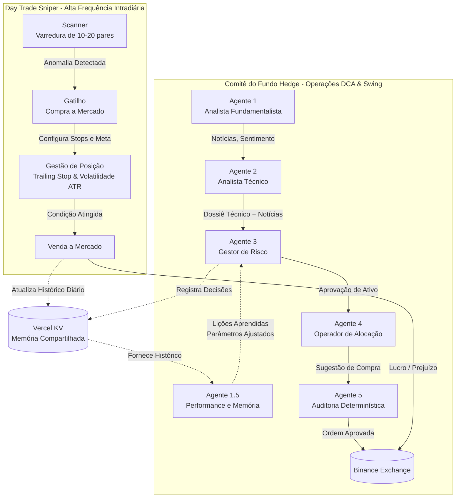

# Arquitetura Multi-Agentes - Ivanvest AI 🤖📊

O Ivanvest AI é alimentado por um ecossistema complexo de inteligência artificial dividido em dois grandes núcleos de operação: o **Comitê do Fundo Hedge (DCA e Swing Trade)** e o **Day Trade Sniper (Operações Rápidas Intra-diárias)**. 

Cada agente possui um papel específico e interage de maneira hierárquica com os demais para formar um consenso de mercado e tomar decisões de compra, venda ou proteção de capital, imitando a estrutura de uma mesa de operações institucional real.

---

## 🗺️ Diagrama de Arquitetura

---

## 🏛️ Núcleo 1: Comitê do Fundo Hedge
Este núcleo roda ciclicamente (em intervalos configuráveis, como a cada hora ou a cada X minutos) e orquestra a tomada de decisão para montagem de carteira (DCA).

### Agente 1: Analista Fundamentalista (Notícias)
- **Papel:** Olhos e ouvidos do fundo.
- **Função:** Monitora o mercado global. Coleta notícias cripto de múltiplos feeds RSS (CoinDesk, Cointelegraph, Decrypt, etc.), traduz para o português, elabora resumos executivos e extrai o **Sentimento do Mercado** (Bullish, Bearish ou Neutro).

### Agente 1.5: Analista de Performance e Memória (O Cérebro)
- **Papel:** Aprendizado contínuo e calibração.
- **Função:** Inspeciona o histórico das operações (tanto de DCA quanto do Sniper) e extrai **Lições Aprendidas**. Se o mercado estiver estopando o robô repetidas vezes, este agente percebe e reajusta as diretrizes de operação (ex: aperta ou alarga o *Stop Loss*, diminui a meta de lucro ou altera o modo de operação para "Conservador"). Atualiza a "memória de longo prazo" no Vercel KV.

### Agente 2: Analista Técnico Quântico
- **Papel:** O Matemático.
- **Função:** Pega as recomendações fundamentalistas do Agente 1 e as cruza com Análise Técnica pura (RSI, MACD, Bandas de Bollinger, Médias Móveis). Consulta o modelo de linguagem para ponderar se o momento gráfico atual corrobora com a notícia. Ele pode vetar uma notícia boa se o gráfico indicar exaustão (sobrecompra).

### Agente 3: Gestor de Risco (Risk Manager)
- **Papel:** O Chefe da Mesa.
- **Função:** Recebe o dossiê completo (Notícias + Gráfico + Memória do Agente 1.5) e calcula a Volatilidade Diária (ATR). Ele dá o **Veredito Final** sobre a operação, decidindo se a tese se sustenta, se a diversificação está saudável e se vale a pena arriscar o capital.

### Agente 4: Operador de Alocação
- **Papel:** O Tesoureiro.
- **Função:** Uma vez que o Agente 3 aprova a tese, este agente calcula a alocação inteligente do orçamento disponível. Ele divide o montante com base no risco/retorno e define exatamente quanto (em R$ ou USDT) será aportado em cada moeda.

### Agente 5: Auditoria Determinística
- **Papel:** O Compliance (Freio de Mão).
- **Função:** Este não é um agente baseada em IA generativa, mas sim um validador matemático "duro". Ele verifica se o Agente 4 não enlouqueceu alocando mais dinheiro do que o permitido na configuração (`Teto permitido`). Se passar pelo Agente 5, a ordem vai para a Binance.

---

## 🎯 Núcleo 2: Day Trade Sniper
Enquanto o Comitê julga o longo prazo, o **Day Trade Sniper** é o agente autônomo tático que opera de forma independente em um *loop* rápido e agressivo para capturar lucros curtos na volatilidade intradiária.

### Agente Sniper (High-Frequency)
- **Papel:** O Executor de Precisão.
- **Funcionamento:** 
  1. **Scanner:** Varre 10 a 20 pares em USDT buscando anomalias, picos de volatilidade e spreads minúsculos (alta liquidez).
  2. **Gatilho:** Encontrando um alvo, ele dispara uma ordem de compra a mercado e aplica alvos matemáticos milimétricos com base no ATR (*Average True Range*).
  3. **Proteção:** Ativa imediatamente um `Trailing Stop` móvel (que acompanha o preço se ele subir) e um `Stop Loss de Volatilidade`.
  4. **Paciência Ilimitada:** Se o preço não atingir o lucro nos primeiros minutos, o Sniper entra no "Modo Ilimitado", segurando a moeda até que a linha de meta ou o Stop de emergência seja engatilhado (evitando vender no prejuízo só por causa de "tempo limite").
  5. **Comunicação:** Ele emite "pensamentos" em tempo real para a interface, narrando os motivos (ex: *"Mantendo a moeda X: cotação a 2.37. Faltam 0.20% para a Meta."*).

---

## 🧠 Como eles se comunicam?
Os agentes não funcionam em caixas isoladas. O sistema foi desenhado como um "LangChain" orgânico, onde o *Output* (saída) de um agente serve imediatamente de *Input* (entrada) para o prompt do próximo. Toda essa inteligência coletiva é ancorada no **Vercel KV**, que funciona como o hipocampo (memória) da aplicação, permitindo que o Agente 1.5 saiba hoje que o Agente 3 tomou uma decisão ruim ontem, melhorando o robô a cada ciclo.
