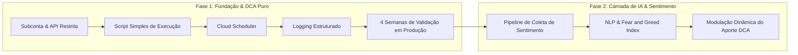

# 🧭 Manifesto IvanvestAI

> *"Transformando a volatilidade e o ruído do mercado em disciplina matemática, execução automatizada e inteligência adaptativa — unindo o rigor do Dollar Cost Averaging (DCA) à análise preditiva de sentimento por IA para acumulação patrimonial consistente."*

---

## 🎯 Nossa Visão

O mercado financeiro moderno é dominado por excesso de ruído, manipulação de sentimento e o constante teste psicológico do investidor: euforia nos topos (FOMO) e pânico nos fundos. Tentar acertar o "timing perfeito" manualmente gera fricção, estresse e destruição de retorno.

O **IvanvestAI** nasce sob a premissa de que **disciplina automatizada supera intuição emocional**. 

Nossa tese combina a estratégia mais sólida e comprovada de acumulação de capital — o **Dollar Cost Averaging (DCA)** — com uma camada progressiva de **Inteligência Artificial de Sentimento**, modular e explicável, capaz de ler as marés do mercado e calibrar aportes sem jamais romper com a gestão de risco.

---

## 🏛️ Pilares Inegociáveis

### 1. Disciplina Algorítmica e DCA Primeiro (*Systematic Execution*)
- O alicerce inegociável é a consistência: aportes periódicos, previsíveis e livres de hesitação humana.
- Antes de qualquer sofisticação preditiva, a engrenagem de execução básica deve ser infalível, pontual e resiliente.

### 2. Segurança Crítica & Isolamento de Risco (*Least Privilege*)
- O princípio do menor privilégio governa todas as integrações: uso estrito de **subcontas dedicadas** na exchange.
- Chaves de API com permissões restritas exclusivamente a ordens a mercado/limite — **permissão de saque (withdrawal) terminantemente bloqueada e desabilitada**.
- Segredos, tokens e chaves nunca expostos em código ou repositórios; gestão via variáveis de ambiente seguras.

### 3. Observabilidade e Logging Estruturado Desde o Dia 1
- Zero caixas-pretas operacionais. Toda chamada de API, resposta da exchange, timestamp, slippage, cotação e status de ordem deve ser registrado em formato de logging estruturado (JSON).
- Rastreabilidade total para auditoria, cálculo de preço médio e diagnóstico imediato de falhas.

### 4. Evolução Consciente em Fases (Validação Prática Antes da Sofisticação)
- A complexidade não deve preceder a validação. A camada de IA e sentimento só é acoplada após comprovação em produção da estabilidade e robustez do pipeline de execução pura.

### 5. Fuga da Desvalorização Fiduciária & Dolarização/Criptoacumulação (*Hard Asset Preference*)
- O Real Brasileiro (BRL) é estritamente uma rampa de entrada (*on-ramp*) para depósitos e aportes periódicos do investidor.
- Manter capital parado em moeda que se desvaloriza no tempo (BRL) é inaceitável para a preservação de poder de compra.
- Todo saldo em BRL deve ser ativamente direcionado para a acumulação de criptoativos fortes (BTC, ETH, etc.) ou convertido para Dólar (USDT/USDC).
- Reservas defensivas e caixas de liquidez devem ser preservados em Dólar ou Cripto, jamais em Reais ociosos.

---

## 📈 Fases do Projeto

### 🔹 Fase 1: DCA Puro & Infraestrutura Resiliente
- Execução periódica automatizada (via Cloud Scheduler + Script leve/Serverless).
- Ordens automáticas enviadas via API oficial da exchange em subconta isolada.
- Logging estruturado completo e telemetria de saldo e execução.
- **Validação contínua por 4 semanas** sem alterações de estratégia, garantindo tolerância a falhas, reconexões e pontualidade.

### 🔹 Fase 2: Camada de Inteligência de Sentimento
- Introdução gradual de processamento de linguagem natural (NLP) e métricas de sentimento (Fear & Greed Index, análise de fluxo e notícias).
- A IA atua como modulador paramétrico: aumentando levemente o aporte em momentos de pessimismo extremo (desconto/oportunidade) e preservando liquidez em momentos de euforia desmedida, mantendo sempre o piso do DCA base.

---

## 👥 Para Quem É o IvanvestAI

- **Investidores Estruturados:** Que acreditam no poder dos juros compostos e da acumulação sistemática de ativos sólidos.
- **Desenvolvedores & Analistas Quantitativos:** Que valorizam código limpo, controle total de suas ordens, segurança de dados e transparência algorítmica.
- **Investidores que Eliminam o Fator Emocional:** Aqueles que não querem passar o dia olhando gráficos ou operando no calor das notícias.

---

## 🚫 O Que o IvanvestAI NÃO É

- **NÃO é robô de alta frequência (HFT) ou alavancagem suicida:** Não operamos futuros alavancados nem realizamos dezenas de trades por minuto.
- **NÃO é um esquema de promessas de retorno garantido:** Ganhos no mercado são derivados de paciência, gestão de risco e consistência.
- **NÃO tem custódia de terceiros:** O capital e as chaves pertencem ao próprio usuário em sua respectiva exchange.

---

## ⚙️ Próximos Passos Imediatos

1. **Criar subconta na exchange e gerar chave de API restrita** (com permissão única de negociação spot, IP whitelist quando aplicável e saque expressamente bloqueado).
2. **Implementar a Fase 1 (DCA puro)** via script simples + Cloud Scheduler (cron resiliente e sem overhead).
3. **Validar por 4 semanas** antes de introduzir a camada de sentimento (Fase 2).
4. **Configurar logging estruturado desde o primeiro dia** (JSON format, rastreamento de ordens, tratamento de erros e alertas de falha).

---

*“A consistência vence a genialidade desorganizada. Automatize a disciplina, controle o risco e deixe os juros compostos trabalharem.”*
