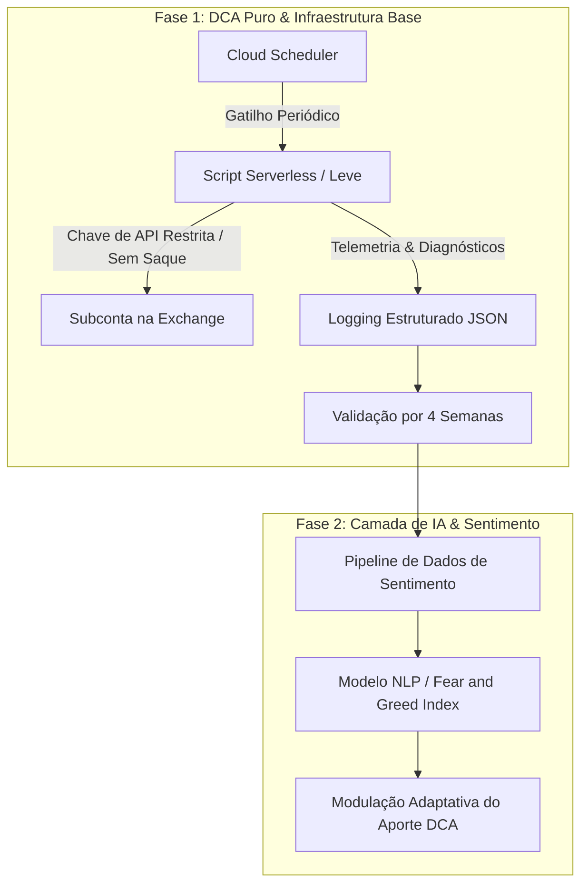

# 🚀 IvanvestAI

> **Automação inteligente de investimentos: unindo o rigor do Dollar Cost Averaging (DCA) à modulação preditiva de sentimento por IA.**

---

## 📌 Sobre o Projeto

O **IvanvestAI** é um sistema automatizado de investimento construído com foco em **disciplina matemática, segurança rigorosa e evolução modular em fases**. 

O projeto elimina o viés emocional e o desgaste do *market timing*, executando aportes sistemáticos via API com chaves restritas e logging estruturado desde o primeiro dia. Uma vez validada a infraestrutura base, uma camada de Inteligência Artificial de Sentimento entra para modular os aportes de forma adaptativa.

Para ler a visão completa, filosofia e diretrizes inegociáveis, consulte o [MANIFESTO.md](file:///c:/Users/ivanl/OneDrive/Documents/projetos/IvanvestAI/MANIFESTO.md).

---

## 🏗️ Fases da Arquitetura

---

## 🎯 Pilares Inegociáveis

- ⏱️ **DCA Sistemático:** Execução disciplinada, pontual e imune a impulsos de mercado.
- 🔐 **Segurança & Menor Privilégio:** Subconta dedicada na exchange, chave de API com permissão exclusiva de ordens Spot e **saque expressamente desabilitado**.
- 📊 **Logging Estruturado (Dia 1):** Rastreabilidade completa de todas as ordens, cotações, slippage e respostas da exchange em formato JSON.
- 🧪 **Validação Empírica:** 4 semanas de execução ininterrupta na Fase 1 antes de qualquer sofisticação de IA.
- 🧠 **Sentimento como Otimizador (Fase 2):** A IA atua modulando a intensidade dos aportes sem nunca quebrar a estratégia central de acumulação.

---

## 📋 Próximos Passos Imediatos

1. [ ] **Subconta & Chaves de API**: Criar subconta na exchange e gerar chave de API restrita (apenas Spot Trading; sem permissão de retirada).
2. [ ] **Implementação da Fase 1**: Desenvolver script simples de execução de DCA puro integrado a agendador na nuvem (Cloud Scheduler / Cron).
3. [ ] **Logging Estruturado**: Configurar telemetria e logs em formato JSON desde a primeira execução para auditoria completa.
4. [ ] **Janela de Validação**: Monitorar execução contínua em produção por 4 semanas.
5. [ ] **Design da Fase 2**: Modelagem do pipeline de coleta e processamento de sentimento de mercado com IA.
